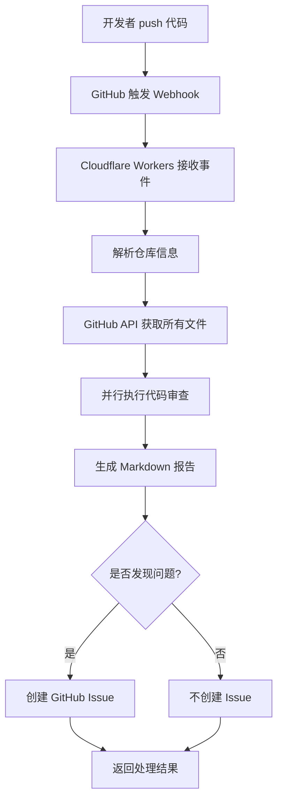
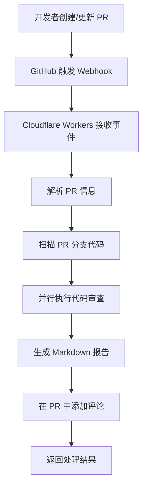

# Mastra GitHub 自动代码审查系统
# TODO：
  #### 1.由于github webhook超过10s未响应2XX，就会请求超时。需要设置队列来移步处理解决这个问题，以便服务器可以立即响应，然后异步处理请求。
  #### 2.用公司规范库来进行代码静态检查，使用RAG 

> 基于 **Mastra + OpenAI + Cloudflare Workers** 的智能代码审查系统
>
> 当你向 GitHub 仓库 push 代码或创建 Pull Request 时，自动扫描整个仓库，执行 AI 代码审查，并将结果以 Issue 或 PR 评论的形式反馈到 GitHub。

[](LICENSE)
[](https://workers.cloudflare.com/)
[](https://openai.com/)

## 🌟 核心特性

### ✅ 全自动化工作流
- **零手动操作** - Push 或 PR 后自动触发，无需手动调用 API
- **自动扫描** - 递归获取仓库所有代码文件（智能过滤）
- **自动审查** - 静态分析 + AI 深度分析并行执行
- **自动反馈** - 结果自动创建 GitHub Issue 或 PR 评论

### 🔍 双层智能审查

#### 静态分析（快速检测）
- ✅ `no-console` - 检测调试语句（console.log/debug/info）
- ✅ `no-hardcoded-secrets` - 检测硬编码密钥和密码
- ✅ `todo-comment` - 检测 TODO 注释

#### AI 深度分析（GPT-4o-mini）
- **代码质量** - Bug、边界条件、错误处理
- **安全性** - SQL 注入、XSS、密钥泄露
- **性能** - 算法效率、内存泄漏
- **最佳实践** - 命名规范、代码结构、可维护性
- **可读性** - 清晰度、文档完整性

### 🔗 GitHub 原生集成
- **Webhook 触发** - 无需配置 CI/CD，直接使用 GitHub Webhook
- **Issue 报告** - Push 发现问题时自动创建 Issue
- **PR 评论** - Pull Request 中直接显示审查结果
- **私有仓库支持** - 使用 GitHub Token 访问私有仓库
- **Markdown 格式** - 专业的报告格式，易读易懂

### 🚀 极简设计
- **只有 2 个 API 端点** - `/health` 和 `/webhook/github`
- **零配置** - 只需设置 2 个环境变量
- **全球部署** - 基于 Cloudflare Edge Network
- **无服务器** - 按需计费，零运维成本

---

## 📁 项目结构

```
mastra-workflow-codereview/
├── src/
│   ├── index.ts                    # Cloudflare Workers 入口（435 行，只有 2 个端点）
│   ├── mastra/
│   │   └── index.ts                # Mastra 配置（注册工作流和代理）
│   ├── tools/
│   │   ├── static-analyzer.ts      # 静态分析工具（3 个规则）
│   │   └── github-scanner.ts       # GitHub 仓库扫描工具
│   ├── agents/
│   │   └── code-reviewer.ts        # AI 审查代理（GPT-4o-mini）
│   └── workflows/
│       └── code-review-workflow.ts # 审查工作流（3 个步骤）
├── wrangler.toml                   # Cloudflare Workers 配置
├── package.json                    # 依赖管理
├── tsconfig.json                   # TypeScript 配置
├── .dev.vars.example               # 环境变量示例
├── README.md                       # 主文档（本文件）
├── QUICKSTART.md                   # 5 分钟快速开始
└── API.md                          # 完整 API 文档
```

---

## 🚀 快速开始

### 前置要求

- Node.js 18+
- npm 或 yarn
- Cloudflare 账号（免费）
- OpenAI API Key
- GitHub Personal Access Token

### 步骤 1: 克隆并安装 (1 分钟)

```bash
# 克隆项目
git clone <your-repo-url>
cd mastra-workflow-codereview

# 安装依赖
npm install
```

### 步骤 2: 配置环境变量 (2 分钟)

```bash
# 复制环境变量示例
cp .dev.vars.example .dev.vars
```

编辑 `.dev.vars`，填入你的密钥：

```bash
# OpenAI API 密钥
# 从 https://platform.openai.com/api-keys 获取
OPENAI_API_KEY=sk-xxxxxxxxxxxxxxxxxxxxx

# GitHub Personal Access Token
# 从 https://github.com/settings/tokens 创建
# 需要权限：repo (Full control of private repositories)
GITHUB_TOKEN=ghp_xxxxxxxxxxxxxxxxxxxx
```

**创建 GitHub Token 的详细步骤：**
1. 访问 https://github.com/settings/tokens
2. 点击 "Generate new token (classic)"
3. 设置名称：`Mastra Code Review`
4. 选择权限：✅ `repo` (Full control of private repositories)
5. 点击 "Generate token"
6. 复制 token 到 `.dev.vars`

### 步骤 3: 本地测试 (1 分钟)

```bash
# 启动开发服务器
npm run dev

# 在浏览器中访问：http://localhost:8787/health
# 应该看到：{"status": "healthy", ...}
```

### 步骤 4: 部署到 Cloudflare (2 分钟)

```bash
# 登录 Cloudflare（首次需要，会打开浏览器）
npx wrangler login

# 部署到生产环境
npm run deploy

# 部署成功后，你会看到类似输出：
# Published mastra-codereview-worker (0.xx sec)
# https://mastra-codereview-worker.your-subdomain.workers.dev
```

**设置生产环境密钥：**

```bash
# 设置 OpenAI API Key
npx wrangler secret put OPENAI_API_KEY
# 粘贴你的 OpenAI API Key，按回车

# 设置 GitHub Token
npx wrangler secret put GITHUB_TOKEN
# 粘贴你的 GitHub Token，按回车
```

### 步骤 5: 配置 GitHub Webhook (2 分钟)

1. 打开你的 GitHub 仓库
2. 进入 **Settings → Webhooks → Add webhook**
3. 填写以下信息：

| 字段 | 值 |
|------|-----|
| **Payload URL** | `https://your-worker-url.workers.dev/webhook/github` |
| **Content type** | `application/json` |
| **Secret** | (留空，可选) |
| **SSL verification** | ✅ Enable SSL verification |
| **Which events would you like to trigger this webhook?** | 选择 "Let me select individual events" |

4. 勾选触发事件：
   - ✅ **Pushes** - 代码推送时触发
   - ✅ **Pull requests** - PR 创建/更新时触发

5. ✅ 勾选 **Active**
6. 点击 **Add webhook**

### ✅ 完成！

现在，每次你 **push** 代码或创建 **Pull Request**，系统都会：

1. 🔍 自动扫描整个仓库
2. 🤖 执行 AI 代码审查
3. 📝 生成详细报告
4. 💬 创建 GitHub Issue 或 PR 评论

---

## 🧪 测试功能

### 测试 Push 事件

在你的仓库中创建一个包含问题的测试文件：

```bash
# 创建测试文件（包含硬编码密钥和调试语句）
echo 'const password = "secret123";
console.log("debug");
// TODO: fix this' > test.js

# 提交并推送
git add test.js
git commit -m "test: trigger code review"
git push origin main
```

**预期结果：**
- 等待 1-2 分钟（取决于仓库大小）
- 在 GitHub Issues 中会看到一个新的 Issue
- Issue 标题：`🤖 代码审查报告 - main (发现 1 个错误)`
- Issue 内容：包含详细的审查报告

### 测试 Pull Request 事件

```bash
# 创建新分支
git checkout -b feature/test-review

# 修改文件
echo 'const apiKey = "sk-123456";' > api.js
git add api.js
git commit -m "add api key"
git push origin feature/test-review

# 在 GitHub 上创建 Pull Request
```

**预期结果：**
- PR 中会自动添加一条评论
- 评论内容：完整的代码审查报告

---

## 📖 API 端点

系统只有 **2 个端点**，保持极简：

### 1. GET /health

健康检查端点。

**用途：**
- 检查服务运行状态
- 监控工具的健康检查端点
- 验证部署是否成功

**请求示例：**

```bash
curl https://your-worker.workers.dev/health
```

**响应示例：**

```json
{
  "status": "healthy",
  "service": "GitHub Auto Code Review",
  "version": "2.0.0",
  "timestamp": "2024-01-01T12:00:00.000Z"
}
```

### 2. POST /webhook/github

GitHub Webhook 处理器（核心功能）。

**功能：**
1. 接收 GitHub `push` 或 `pull_request` 事件
2. 自动扫描整个仓库
3. 执行代码审查
4. 创建 GitHub Issue 或 PR 评论

**触发条件：**
- **Push 事件** - 发现问题时创建 Issue
- **Pull Request 事件** - 总是创建 PR 评论

**工作流程：**

```
GitHub Event → Webhook → 扫描仓库 → 代码审查 → 创建 Issue/评论
```

详细的 API 文档请查看：[API.md](API.md)

---

## 🎯 工作原理

### Push 事件完整流程



### Pull Request 事件完整流程



### 代码审查工作流（3 个步骤）

```
步骤 1: 静态分析
  ↓ 输出: 问题列表 + 统计摘要
步骤 2: AI 审查（GPT-4o-mini）
  ↓ 输出: AI 生成的审查建议
步骤 3: 生成报告
  ↓ 输出: Markdown 格式的完整报告
```

---

## 📊 审查报告示例

系统会生成专业的 Markdown 格式报告：

```markdown
# 🤖 AI 代码审查报告

**仓库**: username/my-awesome-project
**分支**: main
**事件**: push
**时间**: 2024-01-01T12:30:45.678Z

## 📊 审查摘要

| 指标 | 数量 |
|------|------|
| 扫描文件 | 25 |
| 发现问题 | 15 |
| 错误数量 | 2 |
| 关键文件 | 2 |

## ⚠️ 需要优先修复的文件

- **src/auth.ts** - 2 个错误
- **src/config.ts** - 1 个错误

## 📋 详细问题列表

### src/auth.ts

**问题数**: 5 | **错误数**: 2

🔴 **Line 12**: Hardcoded secret detected (`no-hardcoded-secrets`)
🟡 **Line 45**: Debug statement found (`no-console`)
ℹ️ **Line 78**: TODO comment found (`todo-comment`)

### src/config.ts

**问题数**: 3 | **错误数**: 1

🔴 **Line 8**: Hardcoded secret detected (`no-hardcoded-secrets`)
🟡 **Line 23**: Debug statement found (`no-console`)

## ✅ 太棒了！

没有发现任何问题，代码质量良好！

---

🤖 _此报告由 AI-CODEREVIEW 代码审查系统自动生成_
```

---

## 🔧 使用场景

### 场景 1：团队协作 - 代码质量门禁

```bash
# 开发者提交代码
git add .
git commit -m "feat: add user authentication"
git push origin main

# ✅ 自动触发审查
# ✅ 发现问题自动创建 Issue
# ✅ 团队收到通知，及时修复
```

### 场景 2：Pull Request 审查

```bash
# 创建功能分支
git checkout -b feature/new-api

# 开发完成后推送
git push origin feature/new-api

# 在 GitHub 创建 PR
# ✅ 自动在 PR 中添加审查评论
# ✅ Reviewer 可以直接看到代码问题
```

### 场景 3：开源项目 - 贡献者代码审查

```yaml
# 外部贡献者提交 PR
# ✅ 自动审查代码质量
# ✅ 在 PR 中反馈问题
# ✅ 减轻维护者负担
```

---

## ⚙️ 配置与自定义

### 环境变量

| 变量名 | 必需 | 说明 |
|--------|------|------|
| `OPENAI_API_KEY` | ✅ | OpenAI API 密钥，用于 AI 审查 |
| `GITHUB_TOKEN` | ✅ | GitHub Personal Access Token，用于访问仓库和创建 Issue/评论 |

### 自定义静态分析规则

编辑 `src/tools/static-analyzer.ts`，添加自定义规则：

```typescript
// 示例：添加检测 var 关键字的规则
if (/\bvar\s+/.test(line)) {
  issues.push({
    line: idx + 1,
    severity: 'warning',
    message: 'Use const or let instead of var',
    rule: 'no-var',
  });
}
```

### 支持更多编程语言

编辑 `src/tools/github-scanner.ts`，添加文件扩展名：

```typescript
const CODE_EXTENSIONS = [
  '.js', '.jsx', '.ts', '.tsx',  // JavaScript/TypeScript
  '.py',                         // Python
  '.java',                       // Java
  '.go',                         // Go
  '.rs',                         // Rust
  '.rb',                         // Ruby
  '.php',                        // PHP
  '.swift', '.kt',               // Swift/Kotlin
  // 添加更多...
];
```

### 自定义 AI 审查提示词

编辑 `src/agents/code-reviewer.ts`，修改 AI 审查的 `instructions`：

```typescript
instructions: `你是一个专业的代码审查专家。

重点关注：
1. 你关心的第一个维度
2. 你关心的第二个维度
3. ...

输出格式：
...
`,
```

---

## 🔒 安全性

### 密钥管理
- ✅ 使用 Cloudflare Secrets 存储所有敏感信息
- ✅ 密钥不会出现在代码或日志中
- ✅ 支持密钥轮换，无需重新部署

### 权限控制
- ✅ GitHub Token 只需要 `repo` 权限
- ✅ 只读取代码，不修改仓库
- ✅ 支持私有仓库

### 数据安全
- ✅ 所有通信使用 HTTPS
- ✅ 代码不会被持久化存储
- ✅ 仅在审查过程中临时加载到内存

### Webhook 验证（可选）

可以配置 GitHub Webhook Secret 进行签名验证：

```typescript
// 在 src/index.ts 中添加验证逻辑
const signature = c.req.header('X-Hub-Signature-256');
// 验证签名...
```

---

## 📈 性能指标

| 仓库规模 | 文件数 | 预计时间 | OpenAI API 调用 |
|---------|--------|----------|----------------|
| 小型 | < 10 | 30-60 秒 | 10-20 次 |
| 中型 | 10-50 | 60-120 秒 | 20-100 次 |
| 大型 | 50-100 | 2-5 分钟 | 100-200 次 |
| 超大 | > 100 | 3-10 分钟 | 200+ 次 |

**优化建议：**
- 🚀 对大型仓库考虑实现增量审查（只审查变更文件）
- 🚀 使用缓存减少重复审查
- 🚀 监控 OpenAI API 使用量，控制成本

---

## 🐛 故障排查

### 问题 1: Webhook 没有触发

**症状：** Push 或创建 PR 后，没有收到审查结果

**排查步骤：**
1. 检查 Webhook 配置是否正确
   - GitHub → Settings → Webhooks
   - Payload URL 是否正确
2. 查看 Webhook 日志
   - 点击 Webhook → Recent Deliveries
   - 检查响应状态码（应该是 200）
3. 确认 Cloudflare Workers 正在运行
   ```bash
   curl https://your-worker-url.workers.dev/health
   ```

### 问题 2: 没有创建 Issue 或 PR 评论

**症状：** Webhook 触发了，但没有创建 Issue 或评论

**排查步骤：**
1. 确认环境变量已设置
   ```bash
   npx wrangler secret list
   # 应该看到 OPENAI_API_KEY 和 GITHUB_TOKEN
   ```

2. 检查 GitHub Token 权限
   - Token 必须有 `repo` 权限
   - 在 https://github.com/settings/tokens 查看

3. 查看 Workers 日志
   ```bash
   npx wrangler tail
   # 实时查看日志，寻找错误信息
   ```

### 问题 3: 审查超时

**症状：** 大型仓库审查时间过长或超时

**解决方案：**
1. **短期方案**：减少仓库中的代码文件数量
2. **长期方案**：实现增量审查（只审查变更的文件）
3. **配置优化**：增加 Cloudflare Workers CPU 时间限制

### 问题 4: OpenAI API 错误

**症状：** 日志中出现 OpenAI API 相关错误

**常见原因：**
- API Key 无效或过期
- API 配额不足
- API 速率限制

**解决方案：**
1. 验证 API Key 是否有效
2. 检查 OpenAI 账户余额
3. 查看 API 使用情况：https://platform.openai.com/usage

---

## 💡 最佳实践

### 1. 选择合适的触发分支

**推荐配置：**
- ✅ 主分支（main/master）- 启用 push 事件
- ✅ 所有 Pull Request - 启用 pull_request 事件
- ❌ 开发分支 - 避免启用（减少噪音和成本）

### 2. 合理管理 Issue

**建议：**
- 定期关闭已修复的审查 Issue
- 使用标签（`code-review`, `automated`）方便过滤
- 设置 GitHub Actions 自动关闭旧 Issue

### 3. 控制成本

**OpenAI API 成本估算：**
- 小型仓库（10 文件）：~$0.01-0.05 / 次
- 中型仓库（50 文件）：~$0.05-0.20 / 次
- 大型仓库（100 文件）：~$0.20-0.50 / 次

**节省成本的方法：**
- 只在关键分支启用
- 实现文件缓存机制
- 考虑使用更便宜的模型（如 gpt-3.5-turbo）

### 4. 团队协作

**建议：**
- 在团队中分享 Webhook 配置方法
- 制定 Issue 处理流程
- 定期回顾审查报告，改进代码质量

---

## 🚧 路线图

### 即将推出的功能

- [ ] **增量审查** - 只审查变更的文件，提高效率
- [ ] **自定义规则配置** - 通过配置文件管理审查规则
- [ ] **多模型支持** - 支持更多 AI 模型（Claude、Gemini 等）
- [ ] **审查历史** - 记录和展示历史审查数据
- [ ] **团队仪表板** - 可视化代码质量趋势
- [ ] **更多集成** - GitLab、Bitbucket 支持

---

## 🤝 贡献指南

欢迎贡献！请遵循以下步骤：

1. Fork 本仓库
2. 创建功能分支 (`git checkout -b feature/amazing-feature`)
3. 提交更改 (`git commit -m 'feat: add amazing feature'`)
4. 推送到分支 (`git push origin feature/amazing-feature`)
5. 创建 Pull Request

---

## 📄 许可证

MIT License - 查看 [LICENSE](LICENSE) 文件了解详情

---

## 🙏 致谢

本项目使用以下优秀的开源项目和服务：

- [Mastra](https://mastra.ai) - AI 工作流编排框架
- [Cloudflare Workers](https://workers.cloudflare.com/) - 无服务器边缘计算平台
- [OpenAI](https://openai.com/) - GPT-4o-mini AI 模型
- [GitHub API](https://docs.github.com/en/rest) - GitHub 集成
- [Hono](https://hono.dev/) - 轻量级 Web 框架

---

## 📞 获取帮助

- 📖 **文档**：[API.md](API.md) | [QUICKSTART.md](QUICKSTART.md)
- 💬 **问题**：[GitHub Issues](https://github.com/your-repo/issues)
- 🌟 **Star 本项目**：如果觉得有用，请给个 Star！

---

## 🎯 快速开始

```bash
# 1. 克隆并安装
git clone <repo-url>
cd mastra-workflow-codereview
npm install

# 2. 配置环境变量
cp .dev.vars.example .dev.vars
# 编辑 .dev.vars 添加你的密钥

# 3. 部署
npm run deploy
npx wrangler secret put OPENAI_API_KEY
npx wrangler secret put GITHUB_TOKEN

# 4. 配置 GitHub Webhook
# Settings → Webhooks → Add webhook
# URL: https://your-worker.workers.dev/webhook/github
# Events: push, pull_request

# 5. 完成！开始自动代码审查 🎉
```

---

**Made with ❤️ using Mastra, OpenAI, and Cloudflare Workers**
